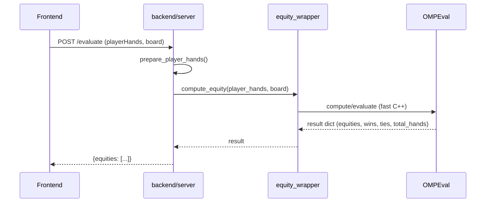

# API Flowcharts

This document contains flowcharts and sequence diagrams for the backend
public APIs. Use a Markdown viewer that supports Mermaid to render the
diagrams.

## Evaluate API (POST /evaluate)

```mermaid
flowchart TD
  A[Frontend] -->|POST /evaluate| B[backend/server.py: evaluate]
  B --> C[prepare_player_hands]
  C --> D[normalize_card]
  B -->|call| E[bindings.equity_wrapper.compute_equity]
  E --> F[OMPEval / native evaluator]
  F --> E
  E --> B
  B -->|JSON: {equities}| A
```

### Sequence (simplified)



## Showdown API (POST /showdown)

The `/showdown` flow is identical to `/evaluate` in the current
implementation — the difference is semantic (showdown implies exhaustive
evaluation). See the above diagrams.
