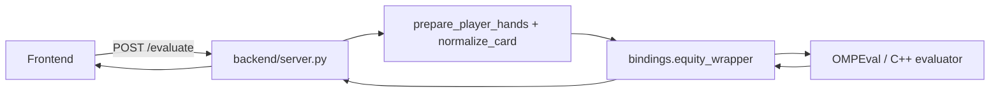

# Model running and evaluator flow

This page explains how the backend triggers and collects model/evaluator
results. It focuses on the path from an HTTP request to the native evaluator
and back to the client.

## High-level flow

## Detailed steps

1. Frontend posts request to `/evaluate` with `playerHands` and optional `board`.
2. `server.evaluate` logs incoming payload (helpful for debugging), then calls
   `prepare_player_hands` to filter/normalize the card strings.
3. The normalized hands and board are passed to `bindings.equity_wrapper.compute_equity`.
4. The pybind11/C++ wrapper translates Python lists into the native internal
   representation (e.g., card masks) and calls the OMPEval evaluation
   routines.
5. The native evaluator returns a result structure; `equity_wrapper` converts
   this back to a Python dict (typically keys: `equities`, `wins`, `ties`, `total_hands`).
6. The server returns `{"equities": [...]}` to the client.

## Notes on performance and debugging

- The heavy work occurs in the native evaluator (C++). If you need to
  profile performance, instrument the C++ side or enable `debug=True`
  in the wrapper (the wrapper currently supports a `debug` flag used in
  logging).
- If results are incorrect, inspect the normalized hands printed by the
  server (the endpoints log `Filtered player hands` and `Filtered board`).
